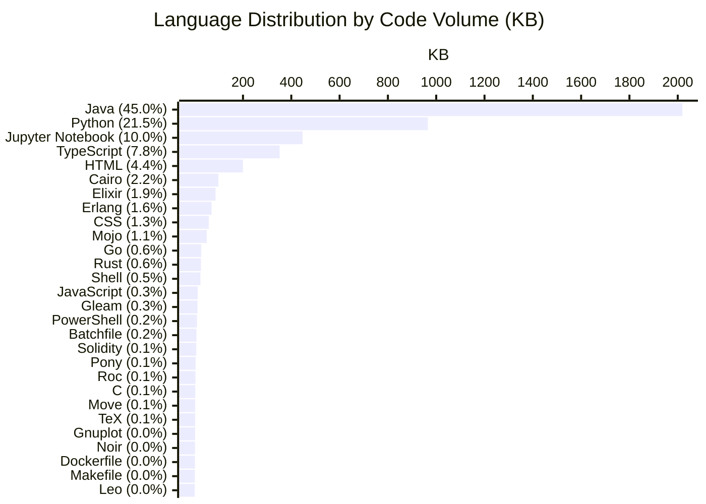
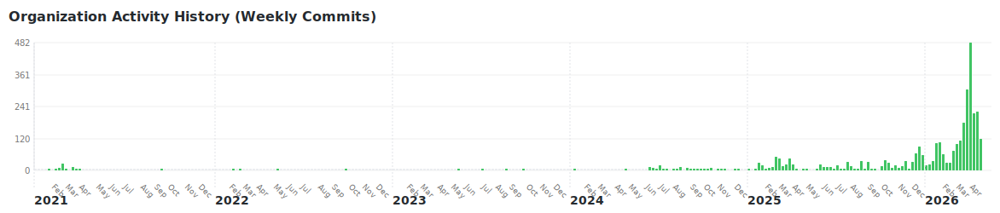

## Welcome to the Kathiravelu Lab.

We are part of the Alaska open-source ecosystem.

We build open-source research frameworks in distributed systems, healthcare informatics, and cloud computing.

## 🔬 Projects

<!-- REPO-LIST:START -->
> Last updated: 2026-04-22 14:30 UTC · 45 active public repositories

| Repository | Language | Description | Stars | Forks | Commits |
| --- | :---: | --- | :---: | :---: | :---: |
| [**.github**](https://github.com/KathiraveluLab/.github) |  |  | ⭐ 1 | 🍴 1 | 🚀 42 |
| [**Alaskan-Season-of-Code**](https://github.com/KathiraveluLab/Alaskan-Season-of-Code) | — | A repository to hold the project ideas and past and current participants of Alaskan Season of Code |  |  | 🚀 11 |
| [**Ararat**](https://github.com/KathiraveluLab/Ararat) |  | DHG Workflow Executor |  |  | 🚀 8 |
| [**AWANTA**](https://github.com/KathiraveluLab/AWANTA) |  | An SD-WAN framework for telehealth access | ⭐ 4 | 🍴 6 | 🚀 168 |
| [**Beehive**](https://github.com/KathiraveluLab/Beehive) |  | A Data Federation Approach to Analyze Behavioral Health and Supplement Healthcare Practice with Community Health Metrics in Alaska | ⭐ 25 | 🍴 72 | 🚀 1308 |
| [**BHV**](https://github.com/KathiraveluLab/BHV) | — | Behavioral Health Vault | ⭐ 16 | 🍴 41 | 🚀 16 |
| [**CAN**](https://github.com/KathiraveluLab/CAN) |  | Content-Aware-Networking |  |  | 🚀 7 |
| [**Cassowary**](https://github.com/KathiraveluLab/Cassowary) |  | Middleware Platform for Context-Aware Smart Buildings with Software-Defined Sensor Networks |  |  | 🚀 24 |
| [**CHIEF**](https://github.com/KathiraveluLab/CHIEF) |  | Controller Farm for Clouds of Software-Defined Community Networks |  |  | 🚀 18 |
| [**Cloud2Sim**](https://github.com/KathiraveluLab/Cloud2Sim) |  | An Adaptive and Distributed Architecture for Cloud and MapReduce Algorithms and Simulations. |  |  | 🚀 35 |
| [**conf-chat**](https://github.com/KathiraveluLab/conf-chat) | — | A P2P Chat |  | 🍴 20 | 🚀 1 |
| [**CSCEA365-Group-Projects**](https://github.com/KathiraveluLab/CSCEA365-Group-Projects) | — |  |  | 🍴 9 | 🚀 3 |
| [**Diomede**](https://github.com/KathiraveluLab/Diomede) |  | DICOM Telemedicine Toolkit | ⭐ 15 | 🍴 32 | 🚀 231 |
| [**Distributed-Computing**](https://github.com/KathiraveluLab/Distributed-Computing) |  | Class resources for the Distributed Computing course |  |  | 🚀 11 |
| [**Dragonfly**](https://github.com/KathiraveluLab/Dragonfly) | — | Distributed Computing Sample Project |  | 🍴 22 | 🚀 3 |
| [**DREAMS**](https://github.com/KathiraveluLab/DREAMS) |  | Digitization for Recovery: Exploring Arts with Mining for Societal well-being. | ⭐ 6 | 🍴 26 | 🚀 418 |
| [**dudu**](https://github.com/KathiraveluLab/dudu) |  | Distributed Near Duplicate Detection for Big Data |  |  | 🚀 18 |
| [**DWiM**](https://github.com/KathiraveluLab/DWiM) | — | DICOM Workflows in MATLAB | ⭐ 1 | 🍴 4 | 🚀 1 |
| [**Epicue**](https://github.com/KathiraveluLab/Epicue) |  | Equity, Privacy, and Integrity with Cairo in Untrusted Environments |  |  | 🚀 34 |
| [**Evora**](https://github.com/KathiraveluLab/Evora) |  | Composing network service chains at the edge: A Resilient and adaptive software‐defined approach |  |  | 🚀 44 |
| [**Faro**](https://github.com/KathiraveluLab/Faro) |  | Near-duplicate detection |  | 🍴 1 | 🚀 5 |
| [**FIRM**](https://github.com/KathiraveluLab/FIRM) |  | Find, Invoke, Return, and Manage |  |  | 🚀 10 |
| [**GUARDA**](https://github.com/KathiraveluLab/GUARDA) |  | Gateway for Uniform Access to Remote Data and Analytics |  |  | 🚀 9 |
| [**IGUANA**](https://github.com/KathiraveluLab/IGUANA) |  | Integrated Guardrails for Unbiased and Adaptive Neural Network Architectures |  |  | 🚀 93 |
| [**L4SBOA**](https://github.com/KathiraveluLab/L4SBOA) |  | L4S Bandwidth Orchestration Architecture | ⭐ 5 | 🍴 7 | 🚀 188 |
| [**LAGOS**](https://github.com/KathiraveluLab/LAGOS) |  | Latency-aware Accountable Governance for Overlay Scaling |  |  | 🚀 14 |
| [**MEDIator**](https://github.com/KathiraveluLab/MEDIator) |  | On-Demand Big Data Integration-as-a-Service: A Data Federation Framework for Reproducible Science |  | 🍴 1 | 🚀 342 |
| [**messaging4transport**](https://github.com/KathiraveluLab/messaging4transport) |  | Message Oriented Middleware for OpenDaylight MD-SAL |  |  | 🚀 23 |
| [**Mojito**](https://github.com/KathiraveluLab/Mojito) |  | Mojo-based Integrated Task Orchestrator |  |  | 🚀 4 |
| [**NetUber**](https://github.com/KathiraveluLab/NetUber) |  | Software-Defined Internet |  |  | 🚀 16 |
| [**Obidos**](https://github.com/KathiraveluLab/Obidos) |  | On-Demand Big Data Integration: A Hybrid ETL Approach for Reproducible Scientific Research |  |  | 🚀 24 |
| [**PORTO**](https://github.com/KathiraveluLab/PORTO) |  | Private Off-chain Resource Tracking and Orchestration. |  |  | 🚀 41 |
| [**robin**](https://github.com/KathiraveluLab/robin) |  | A NodeJS-based proxy for A/B testing |  | 🍴 1 | 🚀 123 |
| [**sanfrancisco**](https://github.com/KathiraveluLab/sanfrancisco) | — | Data Mining Course Project |  | 🍴 24 | 🚀 3 |
| [**SD-CPS**](https://github.com/KathiraveluLab/SD-CPS) |  | Software-Defined Cyber-Physical Systems |  |  | 🚀 18 |
| [**SDDS**](https://github.com/KathiraveluLab/SDDS) |  | Software-Defined Data Services |  |  | 🚀 9 |
| [**SENDIM**](https://github.com/KathiraveluLab/SENDIM) |  | A Simulation, Emulation, aNd Deployment Integration Middleware for cloud networks. |  |  | 🚀 11 |
| [**SFILS**](https://github.com/KathiraveluLab/SFILS) | — | An integrated library system for the San Francisco Public Library. |  | 🍴 25 | 🚀 10 |
| [**Sintra**](https://github.com/KathiraveluLab/Sintra) |  | Self-adaptive Interdomain Network Transport for Real-Time Applications | ⭐ 3 | 🍴 5 | 🚀 83 |
| [**SMART**](https://github.com/KathiraveluLab/SMART) |  | SDN Middlebox Architecture for Resilient Transfers |  |  | 🚀 21 |
| [**TENeT**](https://github.com/KathiraveluLab/TENeT) | — | Telehealth Effectiveness and Necessity Tracker | ⭐ 5 | 🍴 17 | 🚀 19 |
| [**text-based-coding**](https://github.com/KathiraveluLab/text-based-coding) |  | Text-based Coding in Python. A UAA Summer Engineering Academy session | ⭐ 1 |  | 🚀 10 |
| [**Viseu**](https://github.com/KathiraveluLab/Viseu) |  | Virtual Internet Services at the Edge | ⭐ 2 |  | 🚀 159 |
| [**XPD**](https://github.com/KathiraveluLab/XPD) |  | XPD, a Mark-Compact Collector algorithm implementation for MMTk and a micro-benchmark for the GC algorithms in Java, named XPDBench. |  |  | 🚀 13 |
| [**xSDN**](https://github.com/KathiraveluLab/xSDN) |  | An expressive simulator for dynamic network flows. |  |  | 🚀 40 |
<!-- REPO-LIST:END -->

## 📊 Language Distribution

<!-- LANG-CHART:START -->

<!-- LANG-CHART:END -->

## 📈 Organization Activity

<!-- ACTIVITY-CHART:START -->

  

<!-- ACTIVITY-CHART:END -->

## 🏆 Top Contributors

<!-- CONTRIBUTORS:START -->
<table style="border-collapse: collapse; border: none;">
  <tr>
    <td align="center" style="border: none; padding: 10px;"><a href="https://github.com/pradeeban"> <b>pradeeban</b></a> 1780 contributions</td>
    <td align="center" style="border: none; padding: 10px;"><a href="https://github.com/iprasannamb"> <b>iprasannamb</b></a> 201 contributions</td>
    <td align="center" style="border: none; padding: 10px;"><a href="https://github.com/mdxabu"> <b>mdxabu</b></a> 188 contributions</td>
    <td align="center" style="border: none; padding: 10px;"><a href="https://github.com/shivamyadavrgipt"> <b>shivamyadavrgipt</b></a> 165 contributions</td>
    <td align="center" style="border: none; padding: 10px;"><a href="https://github.com/01bps"> <b>01bps</b></a> 100 contributions</td>
  </tr>
  <tr>
    <td align="center" style="border: none; padding: 10px;"><a href="https://github.com/Pragya-rathal"> <b>Pragya-rathal</b></a> 83 contributions</td>
    <td align="center" style="border: none; padding: 10px;"><a href="https://github.com/ayusrjn"> <b>ayusrjn</b></a> 80 contributions</td>
    <td align="center" style="border: none; padding: 10px;"><a href="https://github.com/sk66641"> <b>sk66641</b></a> 72 contributions</td>
    <td align="center" style="border: none; padding: 10px;"><a href="https://github.com/Sahil-u07"> <b>Sahil-u07</b></a> 67 contributions</td>
    <td align="center" style="border: none; padding: 10px;"><a href="https://github.com/ishaanxgupta"> <b>ishaanxgupta</b></a> 66 contributions</td>
  </tr>
  <tr>
    <td align="center" style="border: none; padding: 10px;"><a href="https://github.com/anish1206"> <b>anish1206</b></a> 60 contributions</td>
    <td align="center" style="border: none; padding: 10px;"><a href="https://github.com/ASHISH-JHA94"> <b>ASHISH-JHA94</b></a> 60 contributions</td>
    <td align="center" style="border: none; padding: 10px;"><a href="https://github.com/kartikeyg0104"> <b>kartikeyg0104</b></a> 45 contributions</td>
    <td align="center" style="border: none; padding: 10px;"><a href="https://github.com/Vamsi995"> <b>Vamsi995</b></a> 25 contributions</td>
    <td align="center" style="border: none; padding: 10px;"><a href="https://github.com/AbrhamYishak"> <b>AbrhamYishak</b></a> 24 contributions</td>
  </tr>
  <tr>
    <td align="center" style="border: none; padding: 10px;"><a href="https://github.com/KrishanYadav333"> <b>KrishanYadav333</b></a> 24 contributions</td>
    <td align="center" style="border: none; padding: 10px;"><a href="https://github.com/kallal79"> <b>kallal79</b></a> 22 contributions</td>
    <td align="center" style="border: none; padding: 10px;"><a href="https://github.com/sicaario"> <b>sicaario</b></a> 21 contributions</td>
    <td align="center" style="border: none; padding: 10px;"><a href="https://github.com/Rohhit333"> <b>Rohhit333</b></a> 20 contributions</td>
    <td align="center" style="border: none; padding: 10px;"><a href="https://github.com/zmz223"> <b>zmz223</b></a> 18 contributions</td>
  </tr>
</table>
<!-- CONTRIBUTORS:END -->
